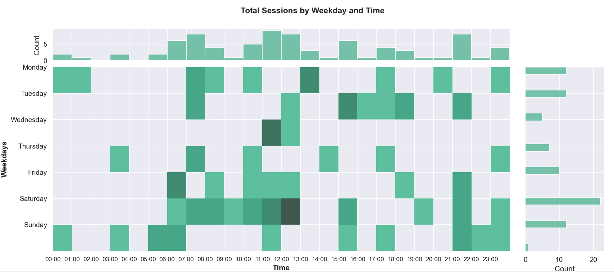
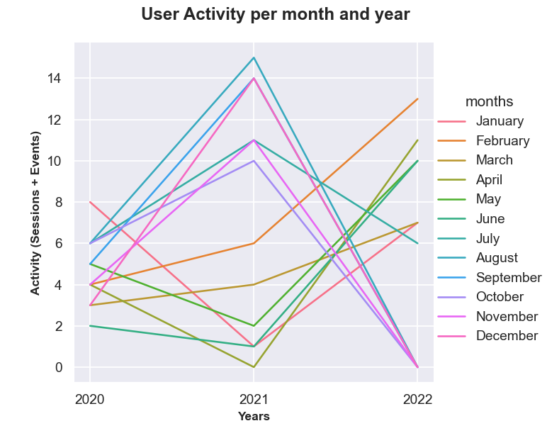

# Seaborn Graphs

The two graphs that were created using the Seaborn library can be found in the 'visualisationSeaborn.py' file in the 'Visualisation' folder and can be displayed by running said file simultaneously to the API-script ('appRestApi.py'). 

Assuming the dependencies have been installed and the 'appRestApi' script is already running, take the following steps to display the Seaborn graphs. To execute the script, open up a second gitbash or terminal and navigate to the Visualisation folder, before entering the command 'py visualisationSeaborn.py'.  Once the first graph that pops up is closed the second will be displayed. 

Please note that running the visualisationSeaborn.py outside of the Visualisation folder, will most likely lead to pathing issues. 

<h4>Why Seaborn?</h4>

The seaborn data visualisation library allows for easier mapping of complex plots than the matplotlib library, which it is based on. This is partly because the plotting functions carry out the semantic mapping internally and operate on dataframes and arrays. 

<h4>Graph 1 - JSON </h4>

This graph retrieves the data from the database via the JSON endpoint and visualizes the total amount of sessions with the help of a diagram that is reminiscent of heat maps and correlation matrices, as well as two marginal bar diagrams. 

These marginal graphs allow for a clearer understanding of the data as well as additional information on the individual axes. Displaying these additional diagrams would be possible using only Matplotlib, however it is more efficient to use Seaborn as it has an inbuilt 'jointplot'-functionality. 

**Data**

To retrieve the data needed for this diagram, requests are made for both the account data and sessions data. However, only the latter is displayed as the total amount of sessions per weekday and time of day in hours. 

The central diagram shows via color shades (darker = higher, lighter = lower), which combination of day and time have the highest amount of user sessions, which gives a visual depiction as to when users are most active. 

The bar diagram placed above the center map displays the total amount of sessions per time of day without correlation to the weekday. Here it is clearly visible which time of day is generally the most active. 

Lastly, the bar chart to the right has the same functionality as the one on top, except it displays the weekdays individual statistics instead of the time. 

**Graph** 

As stated before the center chart is reminiscent of both correlation matrices and heat-maps, and was ultimately chosen as it allows a large amount of data to be depicted in an ordered and accessible manner. 

The marginal graphs give more detailed insights into the individual axes results that show peak times for the day and time respectively. As there is no correlation between the two in these diagrams, bar charts were chosen due to the low complexity, with the ticks corresponding to their values. 

**Screenshot** 

The image below shows the result that is displayed when the aforementioned python script is executed. 

-------

<h4>Graph 2 - XML </h4>

The data depicted within this line graph is imported from two XML files that are included in the project folder. It is used to give insight into the overall user activity for the months per year. 

Here, the Seaborn library was used as it allows for simple visualisation of line plots with separate lines for the individual columns, which are passed in a long-format dataset. 

**Data**

To depict the overall user activity, the dates of all events and sessions are retrieved and the value that matches the year and month is upped by one. Currently there are only three years being displayed as that is whats currently in the xml file. However, the graph is set up to include any date with records for either events or sessions, and will adjust the axis accordingly. As for the graph layout, the y-axis represents the amount of session and event entries, whereas the x-axis displays the year. Each month is represented by a different colored line which is labeled in the legend that can be seen to the right of the graph. 

The necessary dates that are retrieved from the xml files are then converted into long form data, alongside their respective values.  

**Graph** 

Ultimately, a line chart was chosen as it allows for the visualisation of user activity not only for the month in total, but the statistics for the months per year. Using Seaborn this is fairly easy to plot once the data is formatted to fit the long format, as it can be read out by the library to plot without further intervention. 

While it is only slightly more complex than a typical line plot, the usage of other data formats to pass the data, greatly simplifies the process, which is why it was decided not to use Matplotlib on its own in this case. 

**Screenshot** 

The image below shows the result that is displayed when the aforementioned python script is executed and the first diagram has been closed. 

# Matplotlib Graphs
To view these graphs try to execute the 'matplotlibVisualisation.py' alongside the 'appRestApi.py'.  

Assuming the dependencies have been installed and the 'appRestApi' script is already running, take the following steps to display the Seaborn graphs. To execute the script, open up a second gitbash or terminal and navigate to the Visualisation folder, before entering the command 'py matplotlibVisualisation.py'.

Matplotlib is a python library used for plotting the data. It provides an object-oriented API for embedding plots into applications using GUI toolkits. It is designed such that it resembles closely to MATLAB (Matrix Laboratory), which at the time was the most popular programming language in Academia. 

A distinguishing feature of Matplotlib is the Pyplot state machine. This feature enables the user to write concise procedural code. In practice, using Matplotlib wihtout Pyplot is not the best option the represent the data. 

It is also worth noting that since the team could not get the xml-validation in the API to be working in the remaining given time, the visualization then is only processing the data by the means of JSON endpoints

#### Why Matplotlib?

Matplotlib was first released when Python as getting popularity among programmers which helped Matplotlib gain popularity among big data analysist programmers. Matplotlib provides a very user-friendly environment to the programmers and non-IT users alike. For the programmers, it provides them readability when looking at the writer's source of code. And for the users 

There are a lot of libraries that can be installed for visualization in data analysis like Seaborn, Ggplot, Bokeh, Geoplotlib, etc. Seaborn is one of very powerful libraries which is used to create beatuiful charts ina few lines of code. But one thing to note of is that Seaborn is built on top of Matplotlib to tweak Seaborn's default. So having good knowledge in Matplotlib will help the user to use the complicated and famous libraries also.  

#### Data

The data that the user will get from this visualization is the collection of users along with how many quotes, notes, events and sessions are associated with each user. One user can have multiple quotes with zero notes, and the same goes with the other two entries. 

#### Graph type

The graphs that will be displayed by using Matplotlib is bar chart, it is also worth noting that displaying the entire data from all of the tables is not possible since the nature of API can only handle a limited number of get requests. 

